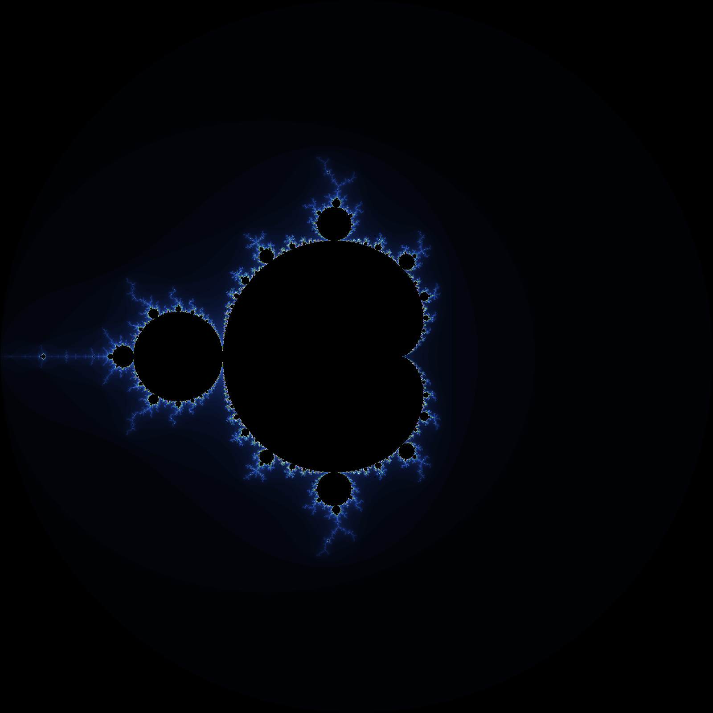
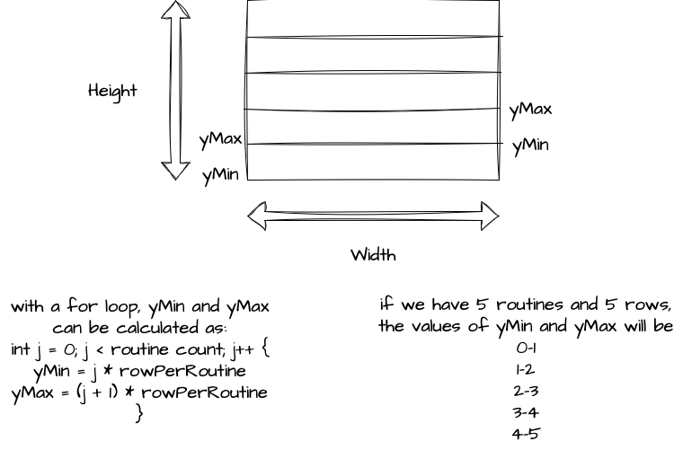

# Mandelbrot set image rendering (but in parallel!)

The mandelbrot set rendering program that I have in this gitHub repository works well,
but it can be better if we use goroutines to parallelize the rendering process.
This is exactly what this program does.

This is a sample image rendered with this program:



## How to run

```bash
go build main.go
```

```bash
go run main.go
```

Here is a visualization of the algorithm about dividing
the image into chunks and rendering each chunk in parallel:

